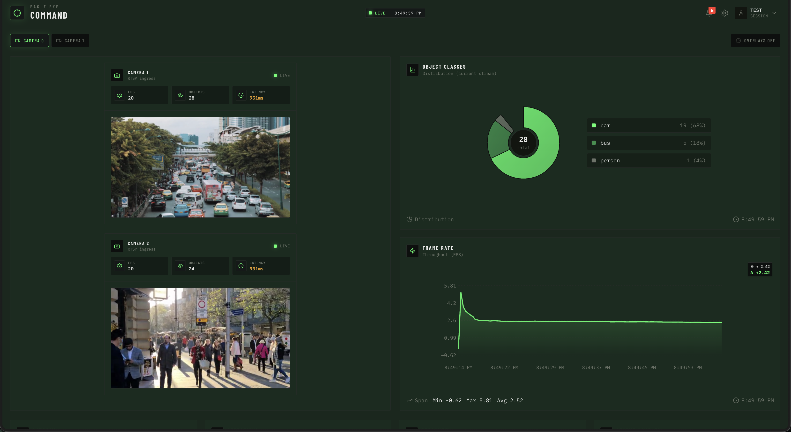
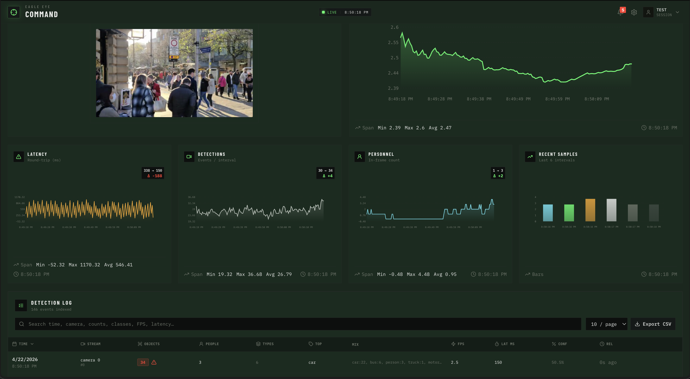
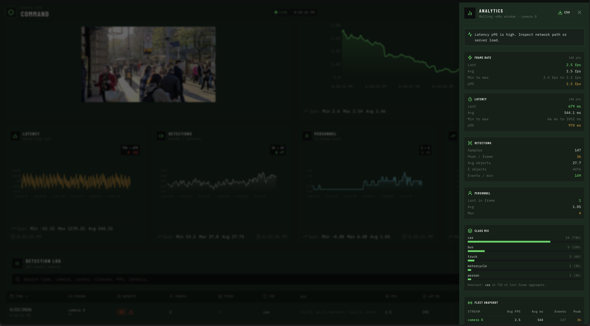
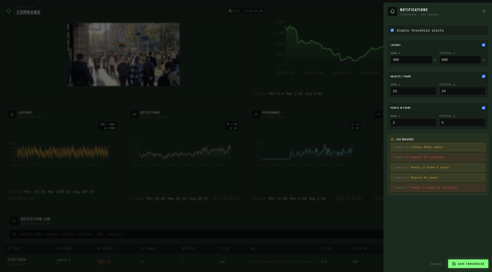

# Eagle Eye

Side project turned operator console: plug in a webcam, local video file or RTSP feed, run detection, and watch the numbers move without staring at a wall of logs.



## Screenshots

**Dashboard.** Video and charts share the screen. Toggle overlays when you only care about throughput, or turn them on when you want every box drawn.



**Analytics** is a slide-out panel with a short health readout, rolled-up stats, and a way to export everything as CSV if you want to keep a snapshot.



**Notifications.** Set warn/critical levels for latency, objects per frame, and people counts. The list previews which streams would trip right now.



## Run it locally

**Frontend** (usually [http://localhost:5173](http://localhost:5173)):

```bash
cd client
cp .env.example .env
npm install
npm run dev
```

Edit `client/.env` so `VITE_WEBSOCKET_*` points at your API (same host/port your FastAPI app uses). Webcam vs RTSP is controlled by `VITE_WEBSOCKET_URL` and `VITE_WEBSOCKET_RTSP_URL` in that file.

**Backend** (example; change the port if yours differs):

```bash
cd socket
cp .env.example .env   # fill in Supabase / OAuth / client URL if you use auth and the DB
uvicorn websocket:app --host 0.0.0.0 --port 5700 --reload
```

Start the socket app first if the UI needs it for login or streaming, then open the client and adjust **Settings** for your source.
